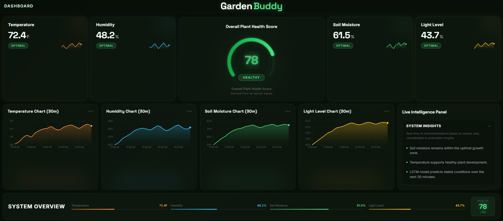
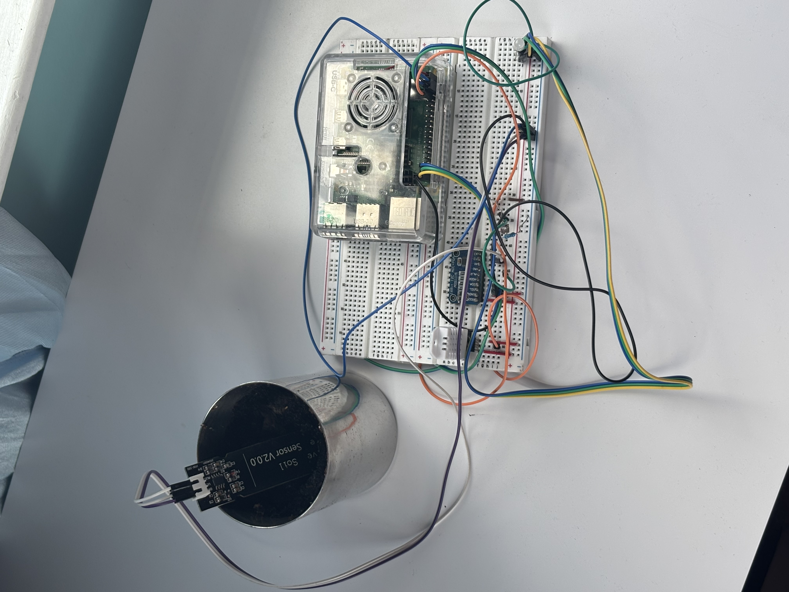

# GardenBuddy

A Raspberry Pi dashboard that watches your garden's soil, temperature, humidity, and light in real time and tells you exactly what to do about it.



---

## Quick Start

Follow the full setup below to get running on a Raspberry Pi with sensors.

---

## Features

- Live readings every 10 seconds: soil moisture, temperature, humidity, and light level
- Rolling 5-minute history charts for each sensor so you can see trends, not just snapshots
- **Garden Health Score** (0–100) that combines all four sensors into a single number
- **AI analysis pipeline**: a custom-trained LSTM classifies plant health from sensor history, then Ollama (llama3.2:3b) generates specific, actionable care recommendations in plain English
- Automated alerts for critical conditions (low soil, heat stress, fungal risk)
- RGB LED on the Pi reflects health score in real time (green / amber / red)
- Writes every reading to InfluxDB for long-term history and querying
- Runs entirely on your local network, no cloud, no API keys, no internet required

---

## How It Works

```
Sensors (every 10s)
    │
    ├─ ADS1115 ADC  → soil moisture %, light %
    └─ DHT22        → temperature °F, humidity %
            │
            ▼
    sensor_reader.py
            │
            ├─ LSTM Model (Model 1)
            │   Looks at the last 30 readings (5 min of history)
            │   Classifies: thriving / stable / stressed / critical
            │
            ├─ Ollama llama3.2:3b (Model 2)
            │   Takes Model 1's output + raw readings
            │   Returns a 2-sentence actionable recommendation
            │   Runs in background every 30s, never blocks sensor polling
            │
            ├─ InfluxDB write
            └─ /api/data  ←  browser polls every 5s
```

**The AI pipeline is a double-model design.** The LSTM is trained on your own sensor history (auto-labelled using the health score formula) so it learns the dynamics of your specific garden, not just static thresholds. It outputs structured signals (health class, primary stressor, confidence) which are handed to the LLM as context. This keeps the LLM prompt grounded in real measurements rather than asking it to reason about raw numbers directly.

**Soil calibration** uses two ADC constants you measure once with your probe:
```python
DRY_VALUE = 21640   # probe reading in dry air
WET_VALUE = 6000    # probe reading fully submerged
```

---

## Hardware



| Component | Purpose |
|---|---|
| Raspberry Pi 3B+ or newer | Main compute |
| ADS1115 16-bit ADC | Reads analog sensors over I²C |
| DHT22 | Temperature + humidity |
| Capacitive soil moisture probe | Soil moisture |
| Photoresistor / LDR module | Light level |
| RGB LED (common cathode) | Health score indicator |

### Wiring

**ADS1115 → Pi (I²C)**

| ADS1115 | Raspberry Pi |
|---|---|
| VDD | 3.3V (Pin 1) |
| GND | GND (Pin 6) |
| SCL | GPIO 3 (Pin 5) |
| SDA | GPIO 2 (Pin 3) |
| A0 | Photoresistor signal |
| A2 | Soil moisture signal |

**DHT22 → Pi**

| DHT22 | Raspberry Pi |
|---|---|
| VCC | 3.3V |
| GND | GND |
| DATA | GPIO 4 (Pin 7) |

Enable I²C first: `sudo raspi-config` → Interface Options → I2C → Enable

---

## Full Setup

### 1. Clone and configure

```bash
git clone https://github.com/YOUR_USERNAME/GardenBuddy.git
cd GardenBuddy
cp .env.example .env
```

Edit `.env` with your InfluxDB credentials.

### 2. Install dependencies

```bash
# Python
pip install flask python-dotenv torch scikit-learn joblib influxdb-client \
            adafruit-circuitpython-ads1x15 adafruit-circuitpython-dht RPi.GPIO

# Frontend
npm install && npm run build
```

### 3. Set up InfluxDB

Install [InfluxDB v2](https://docs.influxdata.com/influxdb/v2/install/), create a bucket called `gardendata`, generate an API token, and paste it into `.env`.

### 4. Set up Ollama

```bash
# Install from https://ollama.com, then:
ollama pull llama3.2:3b
ollama serve
```

### 5. Train the AI model

```bash
python -m ai_model.train_model
```

Trains on your InfluxDB history + synthetic data. Takes ~15 minutes on a modern CPU. Only needs to be run once (or again when you want to retrain on fresh data).

### 6. Run

```bash
python sensor_reader.py
```

Open `http://<your-pi-ip>:5000` from any device on the same network.

```bash
hostname -I   # find your Pi's IP
```

### Run on boot (optional)

```bash
sudo nano /etc/systemd/system/gardenbuddy.service
```

```ini
[Unit]
Description=GardenBuddy
After=network.target

[Service]
ExecStart=/usr/bin/python3 /home/pi/GardenBuddy/sensor_reader.py
WorkingDirectory=/home/pi/GardenBuddy
Restart=always
User=pi

[Install]
WantedBy=multi-user.target
```

```bash
sudo systemctl enable gardenbuddy
sudo systemctl start gardenbuddy
```

---

## Configuration

All tunable settings live at the top of `sensor_reader.py`:

| Setting | Default | What it does |
|---|---|---|
| `POLL_INTERVAL` | `10` | Seconds between sensor reads |
| `HISTORY_LEN` | `20` | Chart data points kept in memory |
| `DRY_VALUE` | `21640` | ADC reading for 0% soil moisture |
| `WET_VALUE` | `6000` | ADC reading for 100% soil moisture |
| `WRITE_INFLUX` | `True` | Disable to skip InfluxDB writes |

Ollama settings are in `ai_model/ollama_advisor.py`:

| Setting | Default | What it does |
|---|---|---|
| `OLLAMA_MODEL` | `llama3.2:3b` | Model used for advice generation |
| `REFRESH_S` | `30` | How often to request new advice |
| `TIMEOUT_S` | `20` | Max wait for Ollama response |

---

## API

| Endpoint | Description |
|---|---|
| `GET /` | Dashboard |
| `GET /api/data` | Latest readings, chart history, insights, and ML prediction |

```json
{
  "temp": 72.4,
  "humidity": 61.2,
  "soil": 48.7,
  "light": 65.0,
  "score": 88,
  "insights": [
    { "message": "AI analysis complete.", "type": "info" },
    { "message": "Soil moisture within optimal range.", "type": "info" }
  ],
  "ml": {
    "health_class": "stable",
    "primary_stressor": "humidity",
    "confidence": 0.91,
    "stress_vector": [0.03, 0.36, 0.08, 0.19]
  },
  "chart": {
    "time": ["12:00:00", "12:00:10"],
    "temperature_f": [72.1, 72.4],
    "humidity": [61.0, 61.2],
    "soil_moisture_percent": [48.5, 48.7],
    "light_percent": [64.8, 65.0]
  }
}
```

---

## Tech Stack

| Layer | Tech |
|---|---|
| Backend | Python 3.11, Flask |
| ML | PyTorch (LSTM), scikit-learn |
| LLM | Ollama (llama3.2:3b, local) |
| Database | InfluxDB v2 |
| Frontend | React 19, TypeScript, Vite |
| Charts | Chart.js |
| Styling | Tailwind CSS |
| Hardware | Adafruit CircuitPython, RPi.GPIO |

---

## Credits

- [Adafruit CircuitPython](https://github.com/adafruit/circuitpython) for the sensor libraries
- [Ollama](https://ollama.com) for making local LLM inference straightforward
- [InfluxDB](https://www.influxdata.com) for time-series storage
